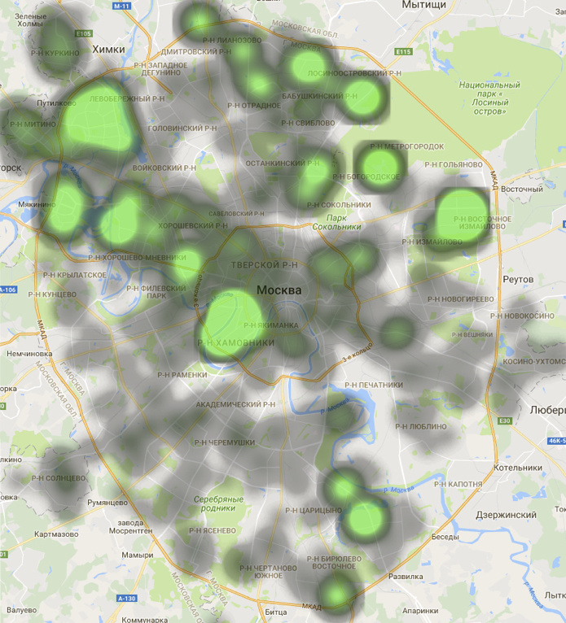

# ПЗЗ - аналитика прошедших слушаний


*Все данные и скрипты приведены в этом репозитории.*

Кроме сноса пятиэтажек в Москве незаметно проходил ещё один важный документ, а именно Правила землепользования и застройки (ПЗЗ). Я о нём ничего не слышал, пока в одном публичном [чатике](https://t.me/mskopendataday), посвящённому открытым данным, активист Ярослав Никитенко не кинул клич, не может ли кто помочь с анализом огромной, 11000-страничной PDF-ки с результатами публичных слушаний ПЗЗ. Мне давно хотелось сделать что-нибудь полезное в этом духе, а эта тема важная, и я вызвался.

## Что такое ПЗЗ?

Приведу не самую строгую, но, на мой взгляд, лучшую по доходчивости встреченную мной формулировку:

***Правила землепользования и застройки*** — *это основанная на Генеральном плане города система градостроительных регламентов, каждый из которых для соответствующей территориальной зоны определяет на достаточно долгую перспективу, какие именно объекты (по назначению, высотным и иным параметрам) можно будет строить на любом участке в ее границах, а какие — нет [(источник)](http://www.pirks.ru/7/94)*

## Что сделано?

* документ PDF переведён в табличный, пригодный для анализа, вид (95% усилий)
* проклассифицированы голоса жителей и резолюции Москвы
* создана карта с геометками со всей информацией на них
* собрано немного аналитики, которую я здесь и приведу

## Исходные данные

Документ состоит из 5 таблиц с 3 столбцами

**Структура таблиц:**

ФИО - Комментарий жителя - Резолюция Москвы

**Заголовки 5 таблиц:**

Предложения и замечания участников публичных слушаний, поступившие..

* в период проведения экспозиции - стр. 1
* во время проведения собрания - стр. 602
* в течение недели со дня проведения собрания участников публичных слушаний - стр. 1263
* в период проведения публичных слушаний от представительных органов муниципальных образований - стр. 10244
* в период проведения публичных слушаний через общегородские информационные сервисы - стр. 10390

## Результаты

* 61645 - Против
* 60610 - За
* 6777 - Затрудняются ответить

## Карта
[публичная ссылка](https://www.google.com/maps/d/viewer?mid=1_dznq4CXP62yII4yJnBd4qkmH7Q&ll=55.76489540197642%2C37.62241796093758&z=11)

<iframe src="https://www.google.com/maps/d/u/1/embed?mid=1_dznq4CXP62yII4yJnBd4qkmH7Q" width="640" height="480"></iframe>


* Записи по одному адресу с одинаковой направленностью (за/против) на карте группируются в одну метку
* Метки могут перекрывать друг друга
* Порой адреса конкретных домов не указываются или не распознаются, поэтому при поиске информации по своему району следует перебрать все проходящие через него улицы

Также я попытался сделать карту интенсивности голосования (heatmap), это получилось так себе.. (для разработчиков: смотрите 7 heatmap.ipynb)

##### Голосование За

*зелёное - более 100 голосов*

##### Голосование Против

*красное - более 500 голосов*

## Подозрительные голоса


*приложения 4 и 5 отброшены, т.к повторения в №5 оправданы форматом интернет-сообщений, а в №4 - небольшим количество муниципальных голосов с особым форматом без повторений; списочные голоса отброшены в силу их заведомой повторяемости*

Видно, что более 8000 комментариев являются повторяемыми более 100 раз досимвольно, не являясь при том списочными. И абсолютно все из них - одобрительные, а практически все из одобрительных - приняты Москвой. 

С голосами против ПЗЗ обратная ситуация: повторяемых более 100 раз нет, а менее повторяемые - отвергаются Москвой.

Вот несколько таких повторяющихся более 100 раз комментариев:

```text
Я , житель Юго-Западного округа Москвы, выступаю за равномерное и гармоничное развитие нашего города и поэтому поддерживаю проект Правил землепользования и застройки. Правила землепользования и застройки обеспечат своевременное строительство новых социальных объектов, обновление и грамотное использование промышленных территорий, защиту сложившейся городской среды и исторической застройки старых московских районов. Правила землепользования и застройки сделают сферу строительства в Москве прозрачной и упорядоченной, минимизируют бюрократическую волокиту и коррупционную составляющую, а значит, сделают наш город более благополучным. Я поддерживаю проект Правил землепользования и застройки г. Москвы
```
страницы 6707 - 7502

```text
Москве нужен порядок в сфере строительства и прозрачность во всех градостроительных процессах, поэтому я выступаю за проект Правил землепользования и застройки. Я против густонаселенных районов без подобающей современному городу инфраструктуры, против точечных объектов, нарушающих сложившуюся среду наших районов. Я за сохранение уникального облика Москвы и закрепление сегодняшнего положения в городе. Правила землепользования и застройки фиксируют текущее состояние города и оставляют места под строительство необходимых для москвичей социальных объектов – школ, детских садов, поликлиник и спортивных комплексов. Я поддерживаю Правила землепользования и застройки г. Москвы
```
страницы 6689 - 7497

```text
Проживающий по адресу:Вилиса Лациса, д. 7 считаю необходимым проект Правил землепользонваия и застройки ПЗЗ г.Москвы. Полагаю, что принятие проекта Правил землепользования застройки приведет к уничтожению противоречий между документами и их трактовками. Кроме того, принятие ПЗЗ приведет к невозможности осуществлять в дальнейшем незаконное строительство в городе Москве путем упорядочения основных показателей обьектов капитального строительстева, в том числе в части зонирования и видов разрешенного использования. В частности, принятие проекта Правил землепользования и застройки позволит разрешить вопросы, возникшие при строительстве жилого дома с детским садом на земельном участке с кадастровым номером 77:08:0009021:1004 по адресу: ул.Живописная, вл. 21. Выступаю за скорейшее завершение строительства этого дома и за благоустройствоо прилегающей к ней территории. Все замечания и предложения по благоустройству ранее были направлены застройщику в рамках публичных слушаний. В связи с вышесказанным, прошу принять проект Правил землепользования и застройки ПЗЗ г.Москвы в целом.
```
страницы 9135-9759

```text
С пректои Правил зумлепользования и застройки ознакомлен, замечаний не имею
```
страницы 9092, 9639, 9647, 9665, 9666, 9669, 9676, 9677, 9678, 9679, 9686, 9693, 9694, 9695, 9696, 9704, 9705, 9712, 9718

В последнем меня поражает орфография и разброс страниц - такое не может быть случайным совпадением.
А в предпоследнем - то, что чуть ли не все жители девятиэтажки единодушно подписался под одним и тем же текстом.
Ещё раз: эти голоса не являются списочными, их записывали и они при  этом совпадают досконально

Таким образом от 8 до 20 тысяч голосов За из всех 60 тысяч голосов За - это крайне подозрительные дубликаты только по посимвольному сравнению этих признаков

## Простая статистика

* **Большинство голосов за - принимаются, против - отвергаются**

55992 / 61465 = 91% голосов против отвергаются

4564 / 60610 = 8% голосов за отвергаются

* **Голосов Против из раздела 5 (интернет) - практически нет**

Только 202/12924 = 2%

* **В то же время голосов За и Против в частях, относящихся к самим слушаниям (2 и 3) - примерно поровну**

50% и 55% Против - соответственно

* **Голоса За не указывают адреса**

41061 / 61645 = 67% голосов Против указали конкретные адреса

8240 / 60610 = 14% голосов За указали конкретные адреса

* **Конкретно указанные адреса понижают шансы на принятие неодобрительных комментариев**

Как ранее было указано, только 9% неодобрительных принимаются к рассмотрению. Если же посчитать только те, в которых указано более 1 адреса - таких то таких останется только 6%

* **Доля списочных голосов у Против в 2 раза выше, чем у За**

37782 / 61465 = 61% у голосов Против

18447 / 60610 = 30% у голосов За

* **Существенная доля голосов Против - коллективные обращения**

13870 / 61465 = 23% у голосов Против

1161 / 60610 = 2% у голосов За